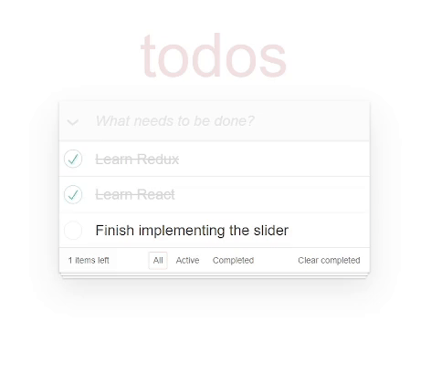

# Todo App
An application where users can manage their tasks efficiently. It includes features for adding, editing, deleting, marking todos as complete, and filtering them based on their status.

## Technologies
- TypeScript
- React
- HTML5
- CSS3 (SCSS)
- Bulma
- Fetch
- React Hooks

## Key Features
- Task Management: Add new tasks, edit existing ones, and delete tasks when they are no longer needed.
- Completion Status: Mark todos as complete or revert them to incomplete.
- Filtering Options: Filter tasks by status: all, completed, or active.

## Demo:
[Todos](https://valeraom.github.io/todo-app/)

## Quick start to run locally
1. Clone the repo.
2. Run npm install (or just npm i).
3. Run npm start.
